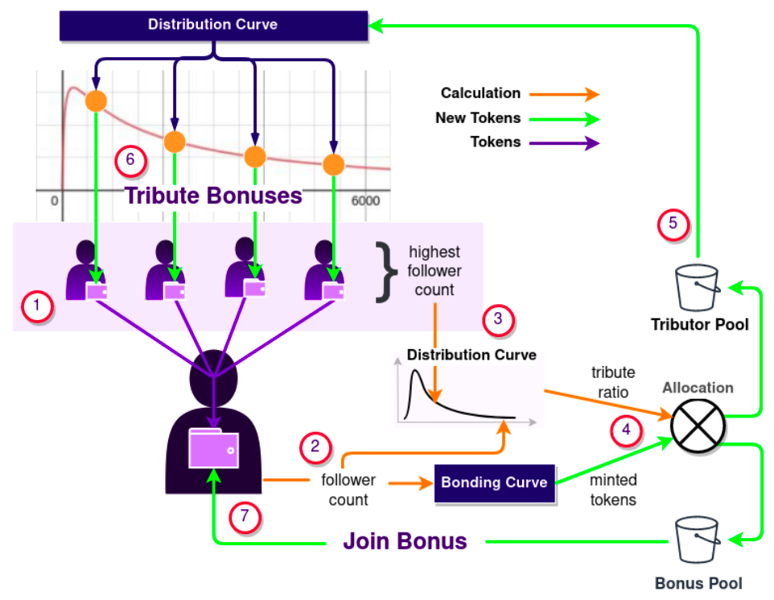

#  Woke Network 🐦<--->🌐³
**Bridging Twitter to Web3**

[Woke
Network](https://about.getwoke.me) brings curation mechanics to the world's (broken) forum - a bridge to decentralised communities on web3.

Crypto-incentivised social networks are the way of the future. Steemit and Cent provide curation mechanisms using the programmable finance native to blockchains, but if a tree falls in the forest and no one tweets about it...

The human conversation is happening on social networks with a critical mass of users: Zucc Et al. have achieved network effects. Tweets are free, extreme beats true, and the loudest dominate. There is no incentive structure encouraging productive conversation.

**v0.1.0 Alpha** [Get Woke or Go Broke](https://getwoke.me)
1. 💸 **Issuance** Securitisation of followers into an ERC-20 using an influence bonding curve
2. 🏭 **Minting** Creation of a social currency that
   is readily spent and equitably distributed.
3. 👛 **Onboarding** “Walletless” onboarding for non-crypto users into the web3
   ecosystem.
4. 🍄 **Powerups** Send tokens to any user on
   twitter using a tweet (walletless transfers).


**Repo Contents**

Monerepo for the Woke Network dApp client, smart-contracts, and back-end services. 

## Economics

Joining the Woke Network consumes your follower count to "power" the Woke
Token ([$WOKEN](https://twitter.com/search?q=%24WOKE&src=typed_query)) minting process. New Wokens are distributed according to users' relative influence to counteract the pareto distribution of followers.

Anyone who has sent you wokens before you joined, called Tributors, will also
receieve a portion of the minted wokens.

The issuance process sets up three incentives for early network growth:
1. Small influence users are able to unlock large bounties of trapped Wokens by hunting “influence whales”
2. Influence whales are encouraged to participate to unlock the Wokens sent to them by whale hunters.
3. Smaller new users receive much larger portions of minted tokens than whales, but distribution is generally biased towards existing users due to the tribute ratio calculation.

### Influence Bonding Curve


1. Tributors transfer Wokens to the “unclaimed” user’s twitter account. We’ll call the new user Udi.
2. Udi completes the account claiming process, triggering an issuance event. Udi’s follower count is used to calculate how many tokens to mint.
3. Udi’s handicap is compared to the highest handicap in the group of tributors to calculate the tribute ratio.
4. The tribute ratio determines the size of the tributor and awakening bonus pools.
5. Tributor allocations are calculated using the distribution curve.
6. Tributor allocations are transferred to the tributors
7. Awakening bonus is transferred to the Udi. Claims process is complete
8. Udi must spend at least half of his dormant Wokens before they are burned.


## Packages


### @woke/wact
wAct is an actor composition framework for [Nact](https://github.com/ncthbrt/nact) that provides
message and actor structure, common actor behaviour (like state machines), and
supervision policies.

Presently being extracted as a stand-alone package: [Wact](https://github.com/jack0son/wact).

### @woke/app
Basic wallet dapp allowing users to signup and securely claim any Wokens they were
sent prior to joining.

React app. Home-rolled web3-hooks package. Spicey.

### @woke/oracle
Simplified [Provable](https://provable.xyz) oracle for local development.

### @woke/server
Burner wallet authentication using
[Hedgehog](https://github.com/AudiusProject/hedgehog), 

In lieu of relay transactions, alpha funds new accounts with a small amount of
goerli ETH to complete the account claiming process.

### @woke/nact-web3
Web3 microservice with self healing subscriptions and transactions. Easily spin
up a web3 backend without worrying about transaction juggling, provider
failures, or subscription reliability. Built with [📬 Wact](https://github.com/jack0son/wact).

Takes responsibility for blockchain nuances, applying its own policies for
problems like account balances, gas usage, and node availability, giving the
rest of the application a much smaller error and API surface to work
with, and some clean assumptions for how web3 interactions are handled.

Presently being extracted as a stand-alone package: [web3-sendee](https://github.com/jack0son/web3-sendee).

### @woke/bot
Tweet powerups, twitter notifications, leaderboard. See [Woke
Network](https://about.getwoke.me).

Architecture is centred around the actor model, courtesty of [Nact](https://nact.io) and [Wact](https://github.com/jack0son/wact).
Recovery-oriented so we can move fast.

### @woke/contracts 
Truffle contract artifacts containing the compiled contract
binaries, method interfaces, and the migration configuration.

Migration configuration is essentially the contract address and network
information for each chain the the contract has been deployed to. Truffle
will continually update this build file as you migrate so a contract
residing on multiple networks can be interacted with using a common artifact.

### @woke/contracts-src
* Solidity source code and truffle based tests.
* Ethereum testchain (ganache), and deployment configuration.

# Deployment
Deploy script help: `./scripts/build.sh -h && ./scripts/deploy.sh -h`

**On build host**
1. Make changes on feature branch
2. Merge into `develop`
3. Merge into `production`
4. Build `./scripts/build.sh -bp`
4. Merge into hooked branch
	+ Netlify: `deploy-netlify`

Deployment branches must always be downstream from develop.

**On production host** (e.g. GCloud COOS)

1. Checkout & pull `production`
2. Pull and start images `bash ./scripts/deploy.sh -pr production`


# Contributing
## Hosting
### Netlify

### Google Cloud

**Configuring docker-compose for Container-Optimized OS**

This [tutorial](https://cloud.google.com/community/tutorials/docker-compose-on-container-optimized-os)
guides you through running Docker Compose in a container on a [Container Optimized
OS](https://cloud.google.com/container-optimized-os/docs/concepts/features-and-benefits) 
instance.

## Ethereum
Goerli is the testnet. Also configured for Rinkeby. Goerli appears to be more
reliable and less congested atm (so fresh).

## Development

**Nodejs:** Just use [nvm](https://github.com/nvm-sh/nvm#installing-and-updating).
```
nvm install 10.17.0
```

**Monorepo setup:**
```
# In project root dir
npm install -g lerna
lerna bootstrap
```

**App:**
To make changes to the app view you don't need any of the back-end services.
To test with local ethereum functionality you must be running the server and
oracle.

```
# Views only
npm run design

# Local instance with local IO
npm run start

```

**Deploy contracts locally**
```
cd @woke/contracts-src
npm run ganache:client

# New terminal
cd @woke/contracts-src
./migrate.sh development
```

**Server:**

```
# Make sure docker is running.
dockerd
# you'll have to use sudo dockerd if you haven't followed the docker
post-install instructions

# Run server DB in docker container
cd @woke/server
npm run db
npm run dev
```

**Oracle:**
```
npm run dev
```

**Bot:**
Not dependency of app.
```
npm run db
npm run dev
```

## Docker
1. You could use this naughty install script, but it's generally a bad idea to
  sudo run scripts from the internet.
* HEED THE [WARNINGS](https://docs.docker.com/install/linux/docker-ce/ubuntu/#install-using-the-convenience-script)
2. OR [Ubuntu installation](https://docs.docker.com/install/linux/docker-ce/ubuntu/)
* [Run docker commands from user land (without
  sudo)](https://docs.docker.com/install/linux/linux-postinstall/)


**Readme todo**
* [ ] Move Woke Network description to blog post.
* [ ] Dev env for testing on mobile.
* [ ] S3 bucket for contract artifacts
